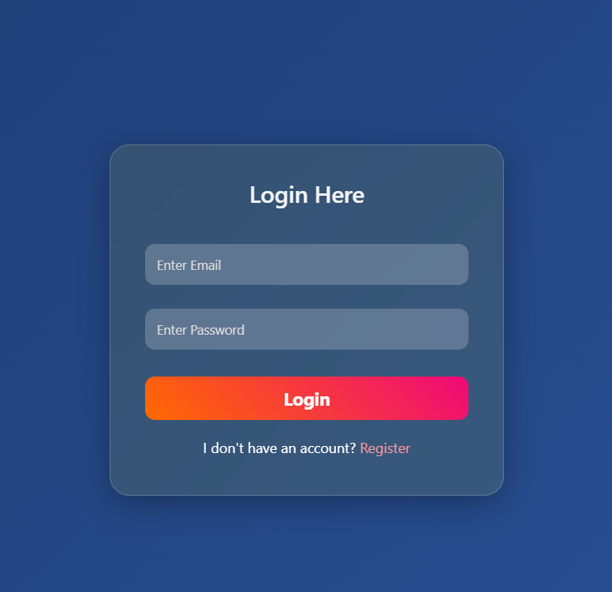
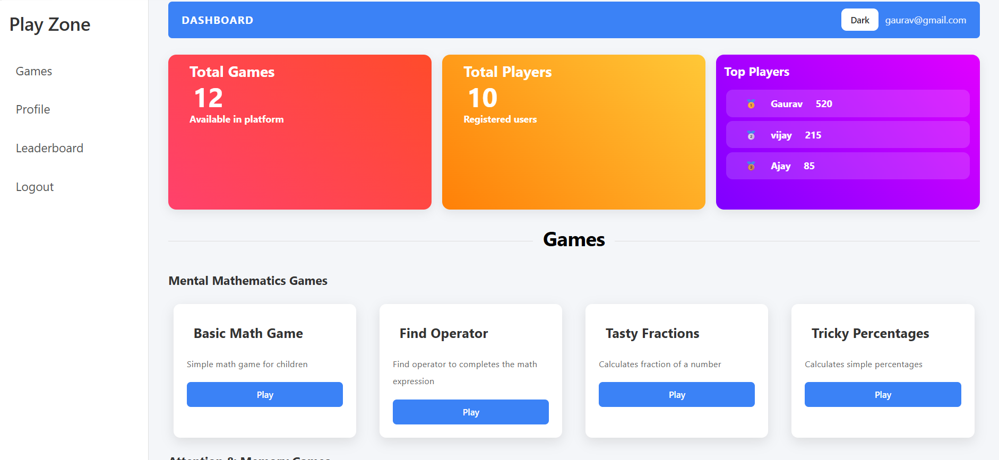
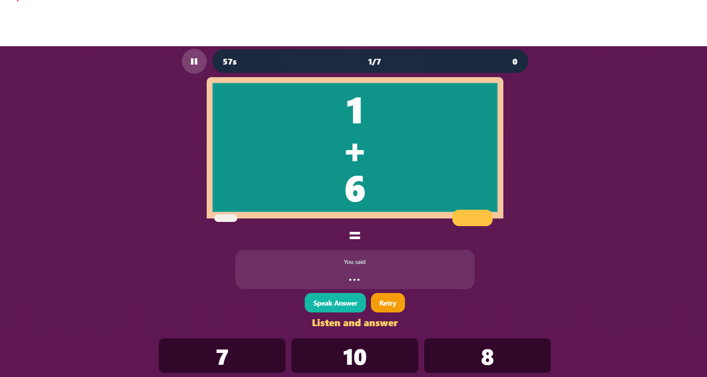
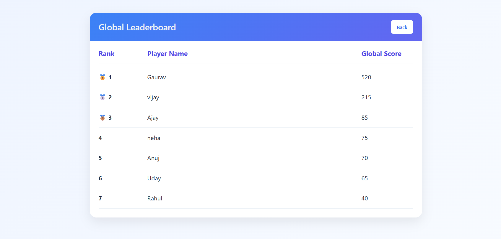
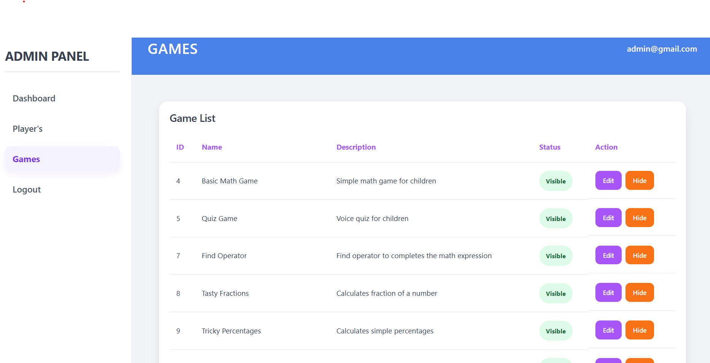

# Voice-Based Educational Gaming Platform

A full-stack voice-based educational gaming platform built with **React**, **Spring Boot**, and **MySQL**, featuring **speech-enabled gameplay, JWT authentication, leaderboard tracking, and admin-controlled game management**.

## Features

- Voice-enabled educational games for children
- JWT-based authentication and role-based authorization
- User dashboard with categorized game sections
- Admin dashboard for user management and game visibility control
- Global leaderboard and score tracking
- Dynamic game rendering based on active game visibility
- Interactive learning modules for math, memory, logic, spelling, rhyme, and vocabulary

## Tech Stack

### Frontend
- React
- React Router
- Axios
- CSS

### Backend
- Spring Boot
- Spring Security
- JWT Authentication
- REST APIs

### Database
- MySQL

## Project Modules

- Authentication module
- User dashboard
- Admin dashboard
- Educational game module
- Voice interaction module
- Score and leaderboard module

## Screenshots

### Authentication Page


### User Dashboard


### Game Page


### Leaderboard Page


### Admin Page


## Folder Structure

```text
Voice-Game-Project
├── VoiceGameApplication
└── voice-game-frontend
